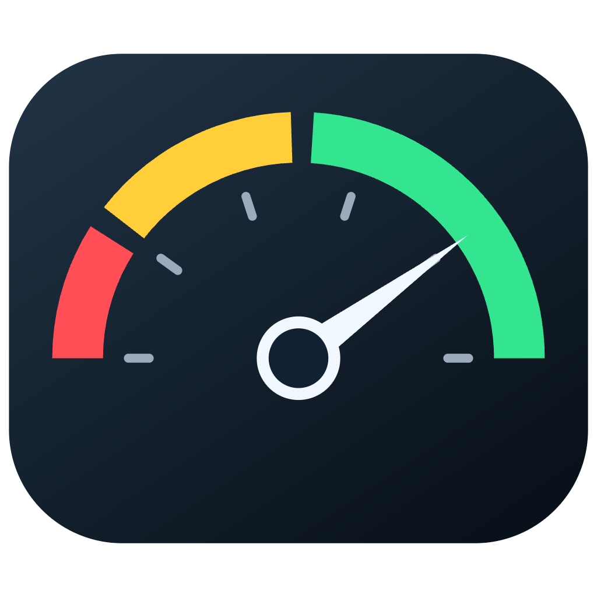
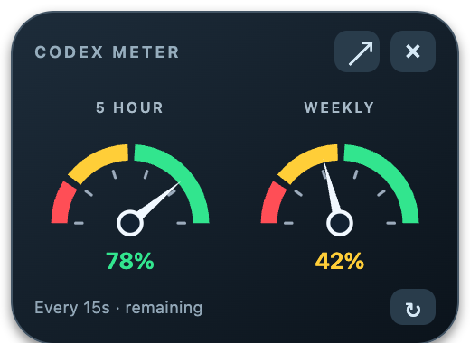
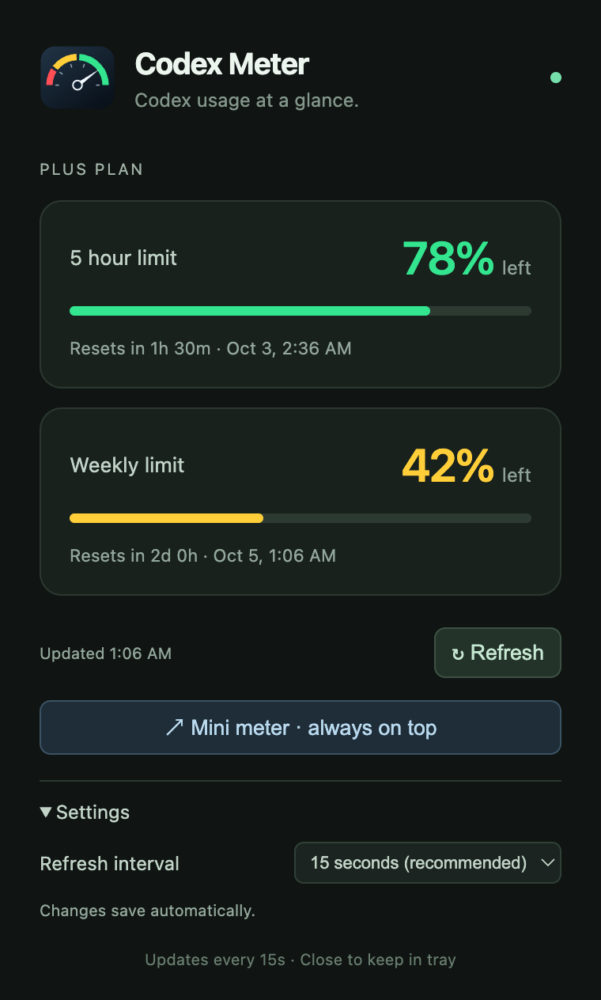
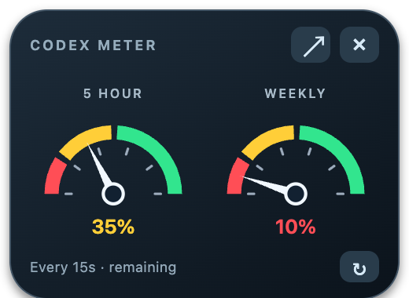

# Codex Meter

Keep your Codex 5-hour and weekly limits visible without opening the usage page.

Codex Meter is a small desktop app for macOS and Windows. It reads the signed-in account through the local Codex CLI and shows how much of each usage window is left.

[Download the latest release](https://github.com/dedsec1911/codex-meter/releases/latest) · [Report a bug](https://github.com/dedsec1911/codex-meter/issues)

## Two views



**Mini meter** stays on top of other windows. Drag it anywhere; click **↗** to open the detailed view or **×** to hide it in the tray.

<details>
<summary>Detailed view and low-quota example</summary>
<br>


</details>

Screenshots show example quotas. The two windows share the same account data and refresh setting.

## Install

Choose the download for your computer from [Releases](https://github.com/dedsec1911/codex-meter/releases/latest).

| Platform | Download | Install |
| --- | --- | --- |
| Intel Mac | `…-mac-x64.zip` | Unzip; move Codex Meter.app to Applications |
| Apple Silicon Mac (M series) | `…-mac-arm64.zip` | Unzip; move Codex Meter.app to Applications |
| Windows 64-bit | `…-win-x64.exe` | Run the installer |

Builds are **unsigned**; Mac builds are not notarized. Your OS may ask you to allow the app. Only proceed if you trust the source. Do not disable Gatekeeper or SmartScreen globally. Releases include SHA-256 checksums.

## Setup

1. Install [Codex](https://github.com/openai/codex) and sign in with your ChatGPT account. An existing desktop/CLI session may be reused when it shares the same credential configuration.
2. Open Codex Meter. It detects common CLI and macOS desktop app locations, including native binaries installed through npm on Windows.
3. If usage is unavailable, run `codex login` and click **Refresh**. If detection fails, right-click the menu bar/system tray icon and select **Choose Codex executable…**.

The executable must be `codex` or `codex.exe`. Windows `codex.cmd` is a launcher, so choose the underlying native binary if auto-detection misses it. Windows and WSL credentials are separate; this version uses the native Windows session. API-key-only sessions do not expose ChatGPT plan quotas.

For a custom install, set `CODEX_METER_BIN` to the executable's absolute path. `CODEX_HOME` is inherited by the Codex child process.

## Usage

- **Mini meter** switches to the floating view. Its position and the selected view survive restarts.
- **Refresh interval** is available in Settings and the tray menu: 1, 5, 10, 15, or 30 seconds; 1, 2, or 5 minutes; or manual only. The default is **15 seconds**. Changes apply immediately.
- **Refresh** requests current usage. Scheduled requests never overlap. Manual-only mode still refreshes on launch and after waking from sleep.
- **Quota selector** appears when Codex reports multiple usage buckets. The selection is shared across both views.
- **Detailed window always on top** and **Launch at login** are in the tray menu. The mini window is always on top.
- Closing a window keeps the app in the tray. Choose **Quit** to exit.

The gauges show **remaining** quota, not consumed quota:

| Remaining | Colour |
| --- | --- |
| 51–100% | Green |
| 20–50% | Yellow |
| 0–19% | Red |

Thresholds use the rounded percentage shown on screen. The tray icon follows the lower available 5-hour/weekly value. Missing values show **—**. A failed refresh keeps the last snapshot and marks it stale; reaching a reset time does not invent a new quota value.

## How it works

Electron provides the windows and tray. Each refresh starts `codex app-server`, initializes its stdio connection, requests [`account/rateLimits/read`](https://learn.chatgpt.com/docs/app-server), and closes the process. No inference requests are made. Short polling intervals start more processes and network requests; 15 seconds is a reasonable default.

The widget does not read or copy auth tokens. Codex handles its own credentials and network connection. Codex Meter has no analytics or usage-history database. It saves the refresh interval, executable preference, view, mini-window position, selected quota bucket, and always-on-top preference locally.

This is an independent project, not an OpenAI product. It is a floating desktop window, not a WidgetKit or Windows Widgets extension. Account access depends on the installed Codex version and credential configuration.

## Development

Requires Node.js 22 or later.

```sh
git clone https://github.com/dedsec1911/codex-meter.git
cd codex-meter
npm ci
npm start
```

```sh
npm test                  # Protocol, quota boundaries, discovery, and scheduling
npm run test:desktop      # Window switching and settings with sample quotas
npm run check:live        # Read limits from your real local Codex session
```

The desktop test needs a graphical session; it never needs account credentials. `check:live` prints normalized quota data only. Regenerate logo PNGs after editing the gauge design with `npm run icons`.

Build on the corresponding OS:

```sh
npm run dist -- --mac --x64 --publish never
npm run dist -- --mac --arm64 --publish never
npm run dist -- --win --x64 --publish never
```

GitHub Actions runs tests and builds on Intel macOS, Apple Silicon macOS, and Windows. Version tags publish the three packages and checksums only after every build succeeds. CI checks use sample data; real-account integration has been checked on Intel macOS.

## License

[MIT](LICENSE)
